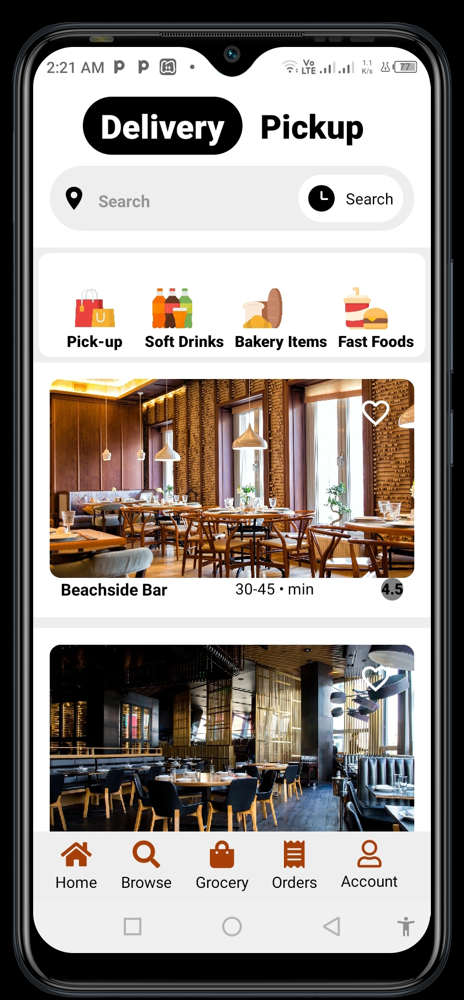
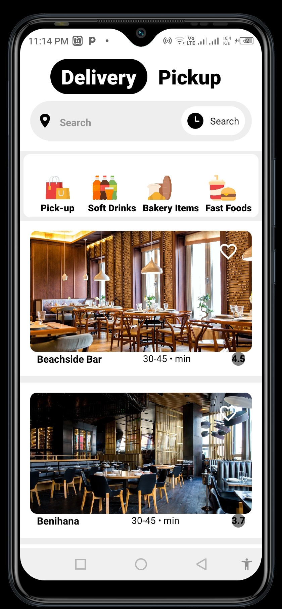

# UberEats
UberEats is a React Native App consuming [YELP Fusion API](https://www.yelp.com/fusion) and [Google MAPS API](https://developers.google.com/maps/documentation/places/web-service/autocomplete)
- It is a hybrid app that can run on cross platforms for both(iOS + Android)

## To run the project you need:
   - [EXPO CLI app](https://play.google.com/store/apps/details?id=host.exp.exponent&hl=en&gl=US)
   - Visual Studio Code

## How to start
- clone this project
- open the downloaded folder through Visual studio code
- In your project directory run : 
    ###  `npm start`
    
- Automatically the application opens your browser and starts localserver `http:localhost:3000/`

## New to React Native ?
- Download node js
- In your browser enable React developer tools
- `npm install -g expo-cli`
- `expo init (projectName)`
- `cd (projectName)`
- `npm start`

## Demo

## Tech Expo.
- [JavaScript](https://developer.mozilla.org/en-US/docs/Web/JavaScript)- Javascript is a web programming that is used for designing user interfaces. It is the mostly used language for the frontend developmnt.
- [React JS](https://reactjs.org) - Javascript library for creating user interfaces. It is declarative, component based and learn once, write anywhere.
- [React Native](https://reactnative.dev/) - A framework for building native applications using React. React Native brings React's declarative UI framework to iOS and Android. With React Native, you use native UI controls and have full access to the native platform. Brings about declarative UI programming.
- [Node JS](https://nodejs.org) - Node.js® is a JavaScript runtime built on Chrome's V8 JavaScript engine.
- [NPM node package manager](https://www.npmjs.com/) - npm is the default package manager for the JavaScript runtime environment Node.js. It consists of a command line client, also called npm, and an online database of public and paid-for private packages, called the npm registry.
- [JSON Objects](https://www.w3schools.com/js/js_json_objects.asp) - JSON Objects contain key/value pairs usually surrounded by curly braces.
- [YELP APIs](https://fusion.yelp.com/) - The Yelp Fusion API allows you to get the best local content and user reviews from millions of businesses across 32 countries
- [GeoMaps Geocoding API](https://developers.google.com/maps/documentation/geocoding/overview) - Geocoding API to find the address for a given place ID.

## Found Interesting ? 😀😀😍 👍 👍👍
- Please support by a clicking star button, raising an issue or contributing to the project in any way.

 ## Lets connect here 👇
 - [Twitter](https://twitter.com/_stephenmuindi)
 - [Linkedin](https://www.linkedin.com/in/stephen-muindi-3a31741a0/)
 - [Github](https://github.com/MuindiStephen)
